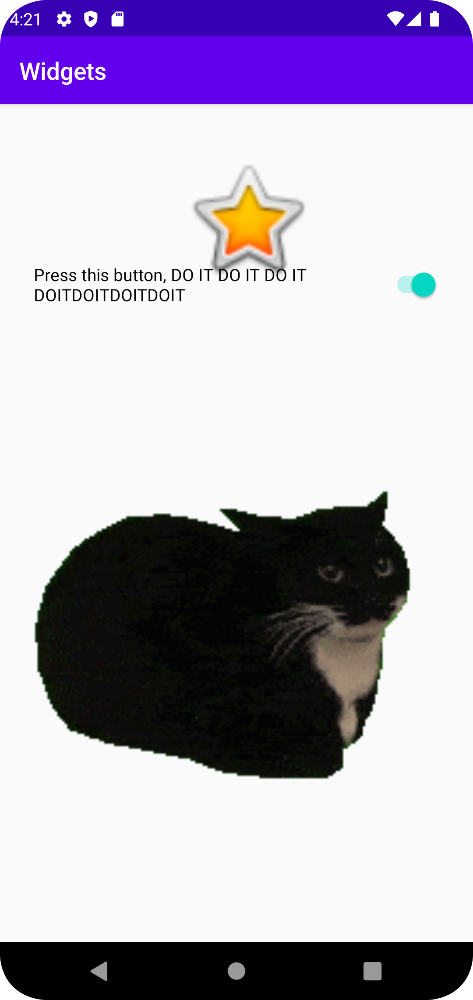

# Rapport

**Skriv din rapport här!**

Lade till en bild av en stjärna med ID:t funnyStar
```
    <ImageView
        android:id="@+id/funnyStar"
        android:layout_width="111dp"
        android:layout_height="124dp"
        android:layout_marginStart="150dp"
        android:layout_marginLeft="150dp"
        android:layout_marginTop="33dp"
        android:layout_marginEnd="150dp"
        android:layout_marginRight="150dp"
        android:layout_marginBottom="574dp"
        app:layout_constraintBottom_toBottomOf="parent"
        app:layout_constraintEnd_toEndOf="parent"
        app:layout_constraintHorizontal_bias="0.0"
        app:layout_constraintStart_toStartOf="parent"
        app:layout_constraintTop_toTopOf="parent"
        app:layout_constraintVertical_bias="0.0"
        app:srcCompat="@android:drawable/btn_star_big_on" />
```

Lade till en switch och en label till den.

```
    <Switch
        android:id="@+id/switch1"
        android:layout_width="337dp"
        android:layout_height="48dp"
        android:layout_marginStart="37dp"
        android:layout_marginLeft="37dp"
        android:layout_marginTop="156dp"
        android:layout_marginEnd="37dp"
        android:layout_marginRight="37dp"
        android:layout_marginBottom="521dp"
        android:text="Press this button, DO IT DO IT DO IT DOITDOITDOITDOIT"
        app:layout_constraintBottom_toBottomOf="parent"
        app:layout_constraintEnd_toEndOf="parent"
        app:layout_constraintStart_toStartOf="parent"
        app:layout_constraintTop_toTopOf="parent"
        app:layout_constraintVertical_bias="1.0" />
```

Lade till en bild på en katt, det var en gif men den rör sig inte, men orkade inte fimla med det.
```
    <ImageView
        android:id="@+id/imageView3"
        android:layout_width="409dp"
        android:layout_height="519dp"
        android:layout_marginStart="1dp"
        android:layout_marginLeft="1dp"
        android:layout_marginTop="211dp"
        android:layout_marginEnd="1dp"
        android:layout_marginRight="1dp"
        android:layout_marginBottom="1dp"
        app:layout_constraintBottom_toBottomOf="parent"
        app:layout_constraintEnd_toEndOf="parent"
        app:layout_constraintStart_toStartOf="parent"
        app:layout_constraintTop_toTopOf="parent"
        app:srcCompat="@drawable/maxwell" />
```

